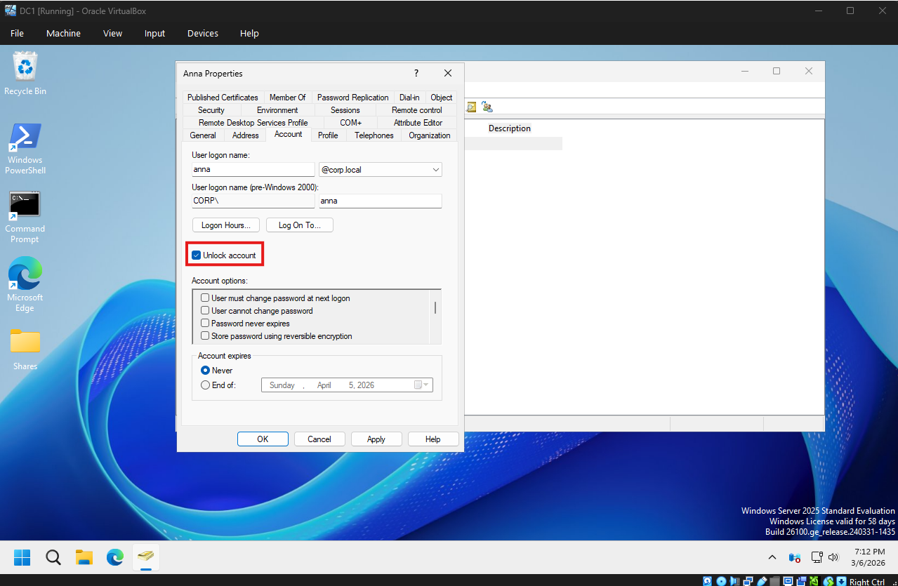

# Ticket 002 – Account Lockout Issue

## Incident Summary
User reported inability to log in to their workstation and company systems due to an account lockout message.

## User Impact
User unable to access workstation and internal systems, preventing them from performing daily work tasks.

## Environment
Windows 10 workstation connected to Active Directory domain environment.

## Troubleshooting Performed
- Verified username and account in Active Directory
- Checked account status using Active Directory Users and Computers
- Confirmed account was locked
- Reviewed failed login attempts
- Confirmed user recently changed password

## Findings
Multiple failed login attempts triggered the domain account lockout policy.

## Root Cause
Incorrect saved credentials on a mobile device repeatedly attempting authentication.

## Resolution / Action Taken
Account unlocked in Active Directory.  
User advised to update stored credentials on all connected devices.

## Screenshot Evidence
Account Lockout:

Account Unlocked:

