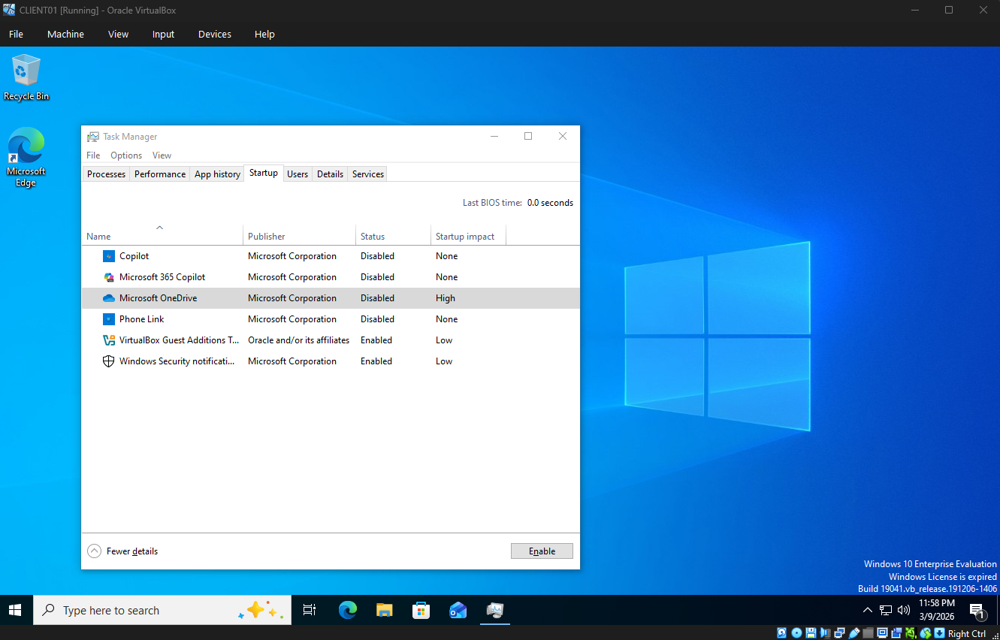
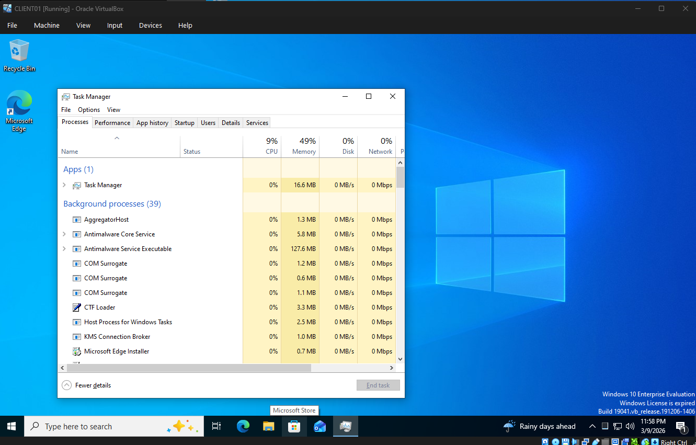

# Ticket 004 – Workstation Performance Issue

## Incident Summary
User reported extremely slow workstation performance when opening applications and performing routine tasks.

## User Impact
User experiencing delays when performing normal work activities.

## Environment
Windows 10 workstation connected to corporate network.

## Troubleshooting Performed
- Checked Task Manager for CPU and memory usage
- Identified high disk utilization
- Reviewed running background processes
- Verified Windows updates status
- Performed disk cleanup
- Restarted workstation

## Findings
Background Windows update process consuming significant disk resources.

## Root Cause
Pending Windows updates running in the background.

## Resolution / Action Taken
Allowed update process to complete and restarted system.  
System performance returned to normal.

## Screenshot Evidence
Workstation Performance before:

Workstation Performance after:

